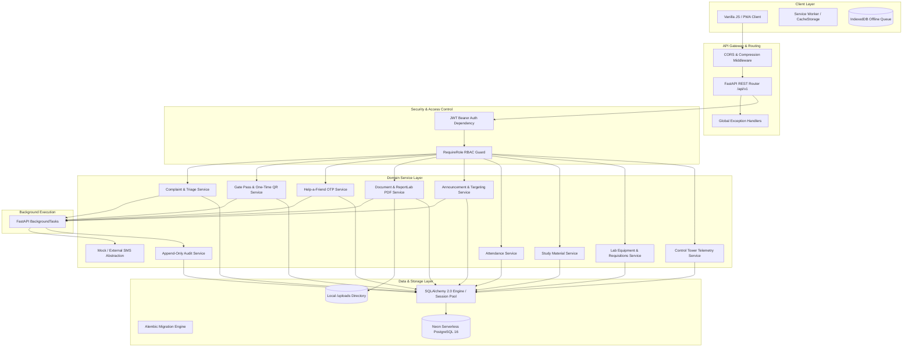
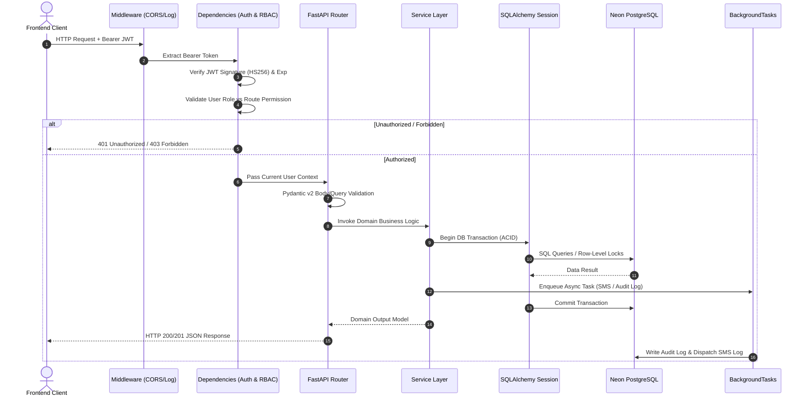
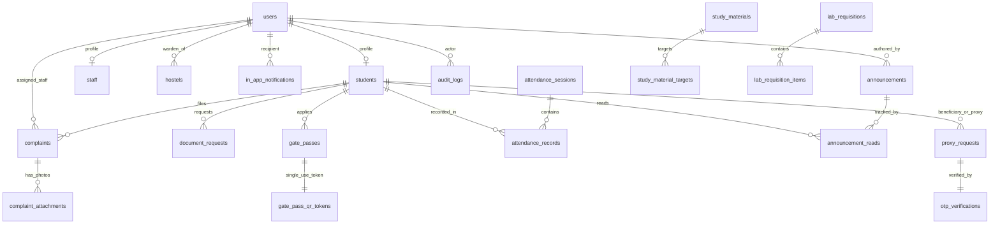
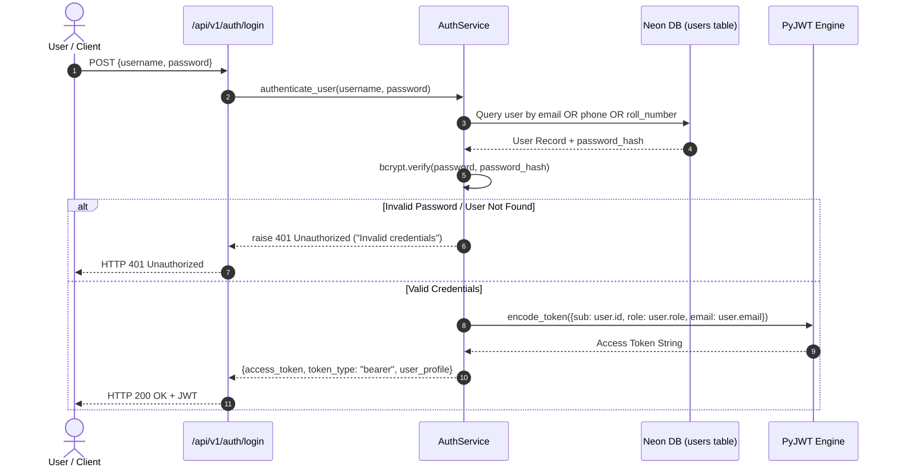
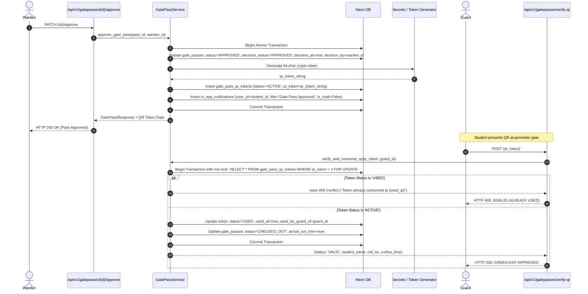
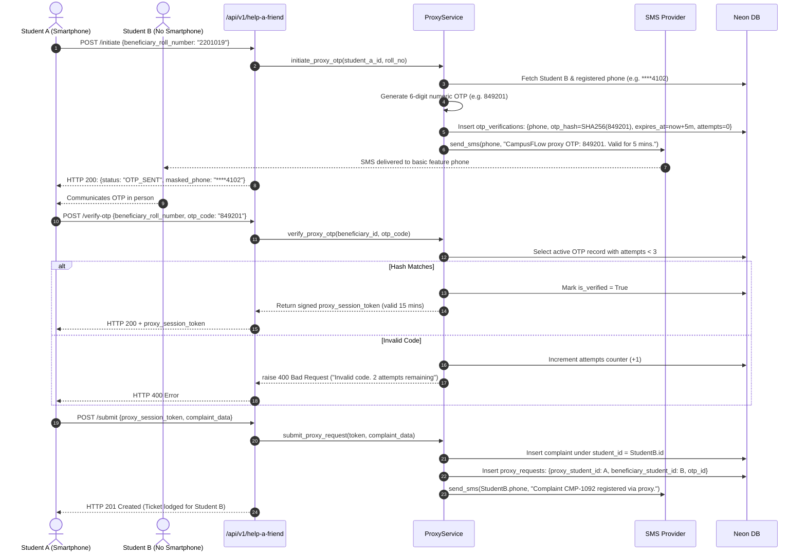

# CAMPUSFLOW: BACKEND ARCHITECTURE & IMPLEMENTATION BLUEPRINT
**Unified Campus Operations Platform — Backend Technical Blueprint**  
*Built for BPUT Hackathon 2026 — Problem Statement 07 (Fretbox)*  
*Document Version: 1.0 | Frozen PRD Baseline: v2.1 | Design Baseline: v1.0 | Tech Stack Baseline: v1.0*

---

## 1. DOCUMENT CONTROL & GOVERNANCE

### 1.1 Source-of-Truth Hierarchy
This backend blueprint translates frozen product and design requirements into concrete, actionable engineering structures without altering or simplifying any requirement:
1. **FROZEN CAMPUSFLOW PRD v2.1** (Authority for WHAT the platform does)
2. **APPROVED CAMPUSFLOW MVP DESIGN DOCUMENT v1.0** (Authority for UX/UI and component behavior)
3. **APPROVED CAMPUSFLOW MVP TECH STACK DOCUMENT v1.0** (Authority for technology selections)
4. **FINAL PRE-IMPLEMENTATION CONSISTENCY AUDIT** (Baseline verification: 100% covered)
5. **This Backend Blueprint** (Defines HOW the backend is organized, modeled, and executed)

### 1.2 Absolute Architectural Boundaries
* **Strictly Prohibited:** Microservices, Redis, Celery, RabbitMQ, Kafka, Kubernetes, distributed transactions, CQRS, GraphQL, multi-region clustering, and enterprise over-engineering.
* **Architecture Style:** **High-Cohesion Modular Monolith** in Python 3.11+ using FastAPI, Pydantic v2, SQLAlchemy 2.0, Alembic, and Neon Serverless PostgreSQL 16.
* **Goal:** A rock-solid, demonstrable hackathon prototype with genuine database persistence, authentic role enforcement, and sub-second execution on patchy campus networks.

---

## 2. BACKEND SYSTEM TOPOLOGY & ARCHITECTURE DIAGRAMS

### 2.1 Overall Backend Architecture Diagram



### 2.2 Request Lifecycle Diagram



---

## 3. COMPLETE BACKEND FOLDER STRUCTURE

The backend follows a clean modular monolith structure where domain logic is encapsulated inside dedicated modules within `app/`:

```
backend/
├── app/
│   ├── main.py                     # FastAPI application entrypoint, CORS, exception handlers
│   │
│   ├── core/                       # Cross-cutting foundational modules
│   │   ├── config.py               # Pydantic Settings (.env loader)
│   │   ├── database.py             # SQLAlchemy async/sync engine, sessionmaker, Base
│   │   ├── security.py             # Bcrypt password hashing, JWT generation/decoding
│   │   ├── dependencies.py         # get_current_user, RequireRole dependency guards
│   │   └── exceptions.py           # Custom domain exception classes
│   │
│   ├── models/                     # SQLAlchemy 2.0 ORM Entity Models (24 entities)
│   │   ├── base.py                 # Common Base & TimestampMixin
│   │   ├── user.py                 # User, Student, Staff models
│   │   ├── hostel.py               # Hostel model
│   │   ├── complaint.py            # Complaint, ComplaintAttachment models
│   │   ├── gate_pass.py            # GatePass, GatePassQRToken models
│   │   ├── proxy_request.py        # ProxyRequest, OTPVerification models
│   │   ├── notification.py         # InAppNotification, SMSNotification models
│   │   ├── announcement.py         # Announcement, AnnouncementRead models
│   │   ├── academic.py             # ClassNotice, AttendanceSession, AttendanceRecord models
│   │   ├── material.py             # StudyMaterial, StudyMaterialTarget models
│   │   ├── lab.py                  # LabEquipment, LabRequisition, LabRequisitionItem models
│   │   └── audit.py                # AuditLog model
│   │
│   ├── schemas/                    # Pydantic v2 Request/Response Validation DTOs
│   │   ├── auth.py                 # LoginRequest, TokenResponse, UserProfileResponse
│   │   ├── complaint.py            # ComplaintCreate, ComplaintUpdate, ComplaintResponse
│   │   ├── gate_pass.py            # GatePassCreate, GatePassDecision, QRVerifyRequest
│   │   ├── proxy.py                # HelpAFriendInitiate, OTPVerifyRequest, ProxySubmit
│   │   ├── document.py             # DocumentRequestCreate, DocumentDecision
│   │   ├── announcement.py         # AnnouncementCreate, AnnouncementResponse
│   │   ├── academic.py             # ClassNoticeCreate, AttendanceSave, MaterialCreate
│   │   ├── lab.py                  # EquipmentUpdate, RequisitionCreate, RequisitionDecision
│   │   └── admin.py                # DashboardTelemetryResponse, AuditLogFilter
│   │
│   ├── routers/                    # FastAPI APIRouter endpoints
│   │   ├── auth.py                 # /api/v1/auth
│   │   ├── complaints.py           # /api/v1/complaints
│   │   ├── documents.py            # /api/v1/documents
│   │   ├── gate_passes.py          # /api/v1/gatepasses
│   │   ├── hostel.py               # /api/v1/hostel
│   │   ├── help_a_friend.py        # /api/v1/help-a-friend
│   │   ├── attendance.py           # /api/v1/attendance
│   │   ├── class_notices.py        # /api/v1/class-notices
│   │   ├── materials.py            # /api/v1/materials
│   │   ├── lab.py                  # /api/v1/lab
│   │   ├── announcements.py        # /api/v1/announcements
│   │   ├── notifications.py        # /api/v1/notifications
│   │   └── admin.py                # /api/v1/admin
│   │
│   ├── services/                   # Encapsulated Domain Business Logic
│   │   ├── auth_service.py         # User credential verification, JWT generation
│   │   ├── complaint_service.py    # Auto-routing heuristics, status transitions, ratings
│   │   ├── gate_pass_service.py    # Warden approval, 1-time QR generation, guard verify
│   │   ├── proxy_service.py        # OTP dispatch, attempt bounding, proxy audit
│   │   ├── document_service.py     # Dues validation, ReportLab PDF rendering, QR stamp
│   │   ├── attendance_service.py   # Roster pre-loading, session persistence, aggregate %
│   │   ├── lab_service.py          # Inventory adjustments, requisition approval state machine
│   │   ├── notification_service.py # In-app alerts, SMS dispatch abstraction
│   │   ├── heuristics_service.py   # Regex triage, recurring hotspot frequency detector
│   │   └── audit_service.py        # Immutable append-only audit persistence
│   │
│   └── utils/                      # Helper utilities
│       ├── pdf_generator.py        # ReportLab canvas builder with embedded Segno QR
│       ├── qr_generator.py         # Segno QR generator
│       ├── sms_provider.py         # Abstracted SMS dispatcher with console logger
│       └── file_storage.py         # Local /uploads file saver with UUID sanitization
│
├── alembic/                        # Database migration scripts
│   ├── env.py
│   └── versions/
│
├── uploads/                        # Local file storage for images & generated PDFs
│   ├── complaints/
│   ├── documents/
│   └── materials/
│
├── tests/                          # Automated pytest suite
│   ├── conftest.py                 # Test client, database fixtures
│   ├── test_auth.py
│   ├── test_complaints.py
│   ├── test_gate_pass.py
│   └── test_help_a_friend.py
│
├── seed.py                         # Comprehensive demo data seed script (all 8 roles)
├── requirements.txt                # Pinned production Python dependencies
├── alembic.ini                     # Alembic configuration
└── .env.example                    # Sample environment variables
```

---

## 4. DATABASE ARCHITECTURE: 24 ENTITIES IN SQLALCHEMY 2.0

All 24 relational entities from the frozen PRD are mapped to SQLAlchemy models, with foreign keys, compound indexes, and explicit status enumerations.

### 4.1 Complete Entity Relationship Overview



### 4.2 Detailed Model Specifications

#### 1. `users`
* `id` (`UUID`, PK)
* `email` (`String(120)`, Unique, Index)
* `phone_number` (`String(15)`, Unique, Index)
* `password_hash` (`String(255)`, Not Null)
* `role` (`Enum(UserRole)`, Index): `'STUDENT'`, `'ADMIN'`, `'WARDEN'`, `'HOSTEL_FACULTY'`, `'TEACHER'`, `'LAB_ASSISTANT'`, `'STAFF'`, `'GUARD'`.
* `first_name` (`String(50)`, Not Null), `last_name` (`String(50)`, Not Null)
* `theme_preference` (`String(10)`, Default: `'light'`)
* `is_active` (`Boolean`, Default: `True`)
* `created_at` (`DateTime`, Default: `utcnow`)

#### 2. `students`
* `id` (`UUID`, PK, FK $\to$ `users.id` on delete CASCADE)
* `roll_number` (`String(30)`, Unique, Index)
* `department` (`String(50)`, Index), `batch_year` (`Integer`), `semester` (`Integer`), `section` (`String(5)`)
* `hostel_id` (`UUID`, Nullable, FK $\to$ `hostels.id`), `room_number` (`String(20)`)
* `dues_cleared` (`Boolean`, Default: `True`)
* `has_smartphone` (`Boolean`, Default: `True`)
* `parent_phone` (`String(15)`)

#### 3. `staff`
* `id` (`UUID`, PK, FK $\to$ `users.id` on delete CASCADE)
* `department_id` (`String(50)`), `designation` (`String(80)`)
* `assigned_lab_id` (`String(50)`, Nullable)

#### 4. `hostels`
* `id` (`UUID`, PK)
* `name` (`String(80)`, Not Null), `code` (`String(20)`, Unique, Index)
* `warden_id` (`UUID`, FK $\to$ `users.id`), `total_rooms` (`Integer`)

#### 5. `complaints`
* `id` (`UUID`, PK)
* `ticket_number` (`String(30)`, Unique, Index) (e.g. `CMP-2026-1042`)
* `student_id` (`UUID`, FK $\to$ `students.id`)
* `category_id` (`String(40)`, Index) (e.g. `plumbing`, `electrical`, `carpentry`, `internet`, `mess`)
* `location_type` (`String(30)`), `location_details` (`String(120)`)
* `title` (`String(150)`), `description` (`Text`)
* `status` (`Enum`, Index): `'OPEN'`, `'ASSIGNED'`, `'IN_PROGRESS'`, `'RESOLVED'`, `'CLOSED'`, `'REOPENED'`, `'COMPLETED'`
* `priority` (`String(20)`, Default: `'NORMAL'`)
* `assigned_staff_id` (`UUID`, Nullable, FK $\to$ `users.id`)
* `sla_deadline` (`DateTime`, Index)
* `resolved_at` (`DateTime`, Nullable)
* `rating` (`Integer`, Nullable, Check: 1 to 5)
* `is_recurring` (`Boolean`, Default: `False`, Index)
* `created_at` (`DateTime`, Default: `utcnow`, Index)

#### 6. `complaint_attachments`
* `id` (`UUID`, PK)
* `complaint_id` (`UUID`, FK $\to$ `complaints.id` on delete CASCADE)
* `file_url` (`String(255)`, Not Null), `file_type` (`String(30)`), `uploaded_at` (`DateTime`, Default: `utcnow`)

#### 7. `document_requests`
* `id` (`UUID`, PK)
* `request_number` (`String(30)`, Unique, Index)
* `student_id` (`UUID`, FK $\to$ `students.id`)
* `document_type` (`Enum`): `'BONAFIDE'`, `'HOSTEL_RESIDENCE'`, `'FEE_ESTIMATE'`
* `purpose` (`String(255)`, Not Null)
* `status` (`Enum`, Index): `'SUBMITTED'`, `'UNDER_REVIEW'`, `'APPROVED'`, `'REJECTED'`, `'COMPLETED'`
* `approved_by` (`UUID`, Nullable, FK $\to$ `users.id`), `rejection_reason` (`Text`, Nullable)
* `document_url` (`String(255)`, Nullable), `verification_hash` (`String(64)`, Nullable, Unique)
* `created_at` (`DateTime`, Default: `utcnow`)

#### 8. `gate_passes` `[MANDATORY EXPLICIT TIMESTAMPS - FIX 2]`
* `id` (`UUID`, PK)
* `pass_number` (`String(30)`, Unique, Index) (e.g. `GP-2026-0882`)
* `student_id` (`UUID`, FK $\to$ `students.id`)
* `pass_type` (`Enum`): `'DAY_OUTING'`, `'HOME_LEAVE'`
* `out_time` (`DateTime`, Not Null), `expected_in_time` (`DateTime`, Not Null)
* `destination` (`String(150)`), `purpose` (`String(255)`)
* `status` (`Enum`, Index): `'PENDING'`, `'APPROVED'`, `'REJECTED'`, `'CHECKED_OUT'`, `'COMPLETED'`, `'OVERDUE'`
* `decision_status` (`Enum`, Index): `'PENDING'`, `'APPROVED'`, `'REJECTED'`
* `decision_at` (`DateTime`, Nullable, Index) *(Explicit decision timestamp)*
* `decision_by` (`UUID`, Nullable, FK $\to$ `users.id`) *(Deciding Warden/Admin)*
* `rejection_reason` (`Text`, Nullable)
* `actual_out_time` (`DateTime`, Nullable, Index) *(Gate exit scan time)*
* `actual_in_time` (`DateTime`, Nullable, Index) *(Gate return scan time)*
* `pin_code` (`String(4)`, Not Null) *(Emergency 4-digit backup PIN)*
* `created_at` (`DateTime`, Default: `utcnow`, Index) *(Request creation time)*

#### 9. `gate_pass_qr_tokens` `[SINGLE-USE NON-ROTATING - FIX 1]`
* `id` (`UUID`, PK)
* `gate_pass_id` (`UUID`, Unique, FK $\to$ `gate_passes.id` on delete CASCADE)
* `qr_token` (`String(64)`, Unique, Index) *(Cryptographically random 64-char token)*
* `student_id` (`UUID`, FK $\to$ `students.id`)
* `generated_at` (`DateTime`, Default: `utcnow`)
* `expires_at` (`DateTime`, Not Null)
* `used_at` (`DateTime`, Nullable, Index) *(Exact consumption timestamp)*
* `used_by_guard_id` (`UUID`, Nullable, FK $\to$ `users.id`)
* `status` (`Enum`, Index): `'ACTIVE'`, `'USED'`, `'EXPIRED'`

#### 10. `in_app_notifications` `[MANDATORY TRANSACTIONAL - FIX 1]`
* `id` (`UUID`, PK)
* `user_id` (`UUID`, Index, FK $\to$ `users.id` on delete CASCADE)
* `title` (`String(120)`, Not Null), `message` (`Text`, Not Null)
* `type` (`String(50)`, Index) (e.g. `'GATE_PASS_APPROVED'`, `'GATE_PASS_REJECTED'`, `'COMPLAINT_RESOLVED'`)
* `entity_id` (`UUID`, Nullable, Index)
* `is_read` (`Boolean`, Default: `False`, Index)
* `created_at` (`DateTime`, Default: `utcnow`, Index)

#### 11. `proxy_requests` `[HELP-A-FRIEND]`
* `id` (`UUID`, PK)
* `entity_type` (`String(30)`): `'COMPLAINT'` or `'DOCUMENT_REQUEST'`
* `entity_id` (`UUID`, Index)
* `proxy_student_id` (`UUID`, FK $\to$ `students.id`) *(Student A - Initiator)*
* `beneficiary_student_id` (`UUID`, FK $\to$ `students.id`) *(Student B - Phone-less peer)*
* `otp_verification_id` (`UUID`, FK $\to$ `otp_verifications.id`)
* `created_at` (`DateTime`, Default: `utcnow`)

#### 12. `otp_verifications` `[HELP-A-FRIEND RATE-LIMITING]`
* `id` (`UUID`, PK)
* `beneficiary_student_id` (`UUID`, FK $\to$ `students.id`)
* `phone_number` (`String(15)`, Not Null)
* `otp_code_hash` (`String(64)`, Not Null) *(SHA-256 of 6-digit numeric code)*
* `purpose` (`String(30)`, Default: `'HELP_A_FRIEND'`)
* `expires_at` (`DateTime`, Not Null, Index) *(5-minute strict lifetime)*
* `is_verified` (`Boolean`, Default: `False`, Index)
* `attempts` (`Integer`, Default: `0`) *(Max 3 attempts permitted)*
* `created_at` (`DateTime`, Default: `utcnow`)

#### 13. `sms_notifications` `[SMS ABSTRACTION]`
* `id` (`UUID`, PK)
* `recipient_phone` (`String(15)`, Not Null)
* `student_id` (`UUID`, Nullable, FK $\to$ `students.id`)
* `message_body` (`Text`, Not Null)
* `trigger_event` (`String(40)`): `'OTP'`, `'CONFIRMATION'`, `'APPROVAL'`, `'OVERDUE'`
* `status` (`String(20)`, Default: `'SENT'`): `'SENT'`, `'FAILED'`
* `dispatched_at` (`DateTime`, Default: `utcnow`)

#### 14. `announcements` `[NOTICE BOARD]`
* `id` (`UUID`, PK)
* `author_id` (`UUID`, FK $\to$ `users.id`)
* `title` (`String(150)`, Not Null), `content` (`Text`, Not Null)
* `priority` (`Enum`, Index): `'NORMAL'`, `'URGENT'`
* `target_branch` (`String(50)`, Nullable), `target_year` (`Integer`, Nullable), `target_section` (`String(5)`, Nullable)
* `target_hostel_id` (`UUID`, Nullable, FK $\to$ `hostels.id`)
* `attachment_url` (`String(255)`, Nullable)
* `created_at` (`DateTime`, Default: `utcnow`, Index)

#### 15. `announcement_reads`
* `id` (`UUID`, PK)
* `announcement_id` (`UUID`, FK $\to$ `announcements.id` on delete CASCADE)
* `student_id` (`UUID`, FK $\to$ `students.id` on delete CASCADE)
* `read_at` (`DateTime`, Default: `utcnow`)
* *Compound Unique Constraint:* `(announcement_id, student_id)`

#### 16. `class_notices` `[TEACHER ACADEMIC]`
* `id` (`UUID`, PK)
* `teacher_id` (`UUID`, FK $\to$ `users.id`)
* `notice_type` (`Enum`): `'CANCELLED'`, `'POSTPONED'`, `'RESCHEDULED'`, `'SWITCHED'`, `'ROOM_CHANGED'`, `'FACULTY_CHANGED'`
* `target_branch` (`String(50)`), `target_year` (`Integer`), `target_semester` (`Integer`), `target_section` (`String(5)`), `subject` (`String(80)`)
* `class_date` (`DateTime`), `period` (`String(30)`), `details` (`Text`)
* `created_at` (`DateTime`, Default: `utcnow`)

#### 17. `attendance_sessions` `[DIGITAL ATTENDANCE]`
* `id` (`UUID`, PK)
* `teacher_id` (`UUID`, FK $\to$ `users.id`)
* `subject` (`String(80)`), `branch` (`String(50)`), `batch_year` (`Integer`), `section` (`String(5)`)
* `session_date` (`DateTime`, Default: `utcnow`, Index)
* `created_at` (`DateTime`, Default: `utcnow`)

#### 18. `attendance_records`
* `id` (`UUID`, PK)
* `session_id` (`UUID`, FK $\to$ `attendance_sessions.id` on delete CASCADE)
* `student_id` (`UUID`, FK $\to$ `students.id`)
* `status` (`Enum`): `'PRESENT'`, `'ABSENT'`, `'LATE'`
* `created_at` (`DateTime`, Default: `utcnow`)
* *Compound Unique Constraint:* `(session_id, student_id)`

#### 19. `study_materials` `[TEACHER NOTES]`
* `id` (`UUID`, PK)
* `teacher_id` (`UUID`, FK $\to$ `users.id`)
* `title` (`String(150)`), `description` (`Text`)
* `file_url` (`String(255)`), `file_type` (`String(30)`)
* `created_at` (`DateTime`, Default: `utcnow`)

#### 20. `study_material_targets`
* `id` (`UUID`, PK)
* `material_id` (`UUID`, FK $\to$ `study_materials.id` on delete CASCADE)
* `branch` (`String(50)`), `batch_year` (`Integer`), `semester` (`Integer`), `section` (`String(5)`), `subject` (`String(80)`)

#### 21. `lab_equipment` `[LAB ASSISTANT]`
* `id` (`UUID`, PK)
* `equipment_id` (`String(40)`, Unique, Index) (e.g. `LAB-MECH-LATHE-04`)
* `name` (`String(100)`), `category` (`String(50)`), `lab_name` (`String(80)`)
* `total_quantity` (`Integer`), `available_quantity` (`Integer`), `damaged_quantity` (`Integer`)
* `working_status` (`Enum`): `'FUNCTIONAL'`, `'NEEDS_REPAIR'`, `'NON_FUNCTIONAL'`
* `maintenance_status` (`String(100)`), `last_updated` (`DateTime`, Default: `utcnow`)

#### 22. `lab_requisitions` `[REQUISITION STATE MACHINE]`
* `id` (`UUID`, PK)
* `requisition_number` (`String(30)`, Unique, Index)
* `assistant_id` (`UUID`, FK $\to$ `users.id`)
* `lab_name` (`String(80)`)
* `status` (`Enum`, Index): `'DRAFT'`, `'SUBMITTED'`, `'UNDER_REVIEW'`, `'APPROVED'`, `'REJECTED'`, `'ORDERED'`, `'COMPLETED'`
* `approved_by` (`UUID`, Nullable, FK $\to$ `users.id`), `rejection_reason` (`Text`, Nullable)
* `created_at` (`DateTime`, Default: `utcnow`, Index)

#### 23. `lab_requisition_items`
* `id` (`UUID`, PK)
* `requisition_id` (`UUID`, FK $\to$ `lab_requisitions.id` on delete CASCADE)
* `item_name` (`String(100)`), `specifications` (`String(200)`), `quantity` (`Integer`), `unit` (`String(20)`), `justification` (`String(255)`)

#### 24. `audit_logs` `[IMMUTABLE COMPLIANCE LEDGER]`
* `id` (`UUID`, PK)
* `entity_type` (`String(40)`, Index) (e.g. `'COMPLAINT'`, `'GATE_PASS'`, `'REQUISITION'`, `'OTP_PROXY'`)
* `entity_id` (`UUID`, Index)
* `action` (`String(60)`, Index) (e.g. `'APPROVE'`, `'REJECT'`, `'CHECKOUT'`, `'RESOLVE'`, `'PROXY_SUBMIT'`)
* `actor_id` (`UUID`, FK $\to$ `users.id`)
* `previous_state` (`JSONB`, Nullable)
* `new_state` (`JSONB`, Nullable)
* `timestamp` (`DateTime`, Default: `utcnow`, Index)

---

## 5. AUTHENTICATION & RBAC ARCHITECTURE

### 5.1 Authentication Flow



### 5.2 Server-Side RBAC Enforcement Code Blueprint
The RBAC dependency verifies role access before invoking controller methods:

```python
# app/core/dependencies.py
from fastapi import Depends, HTTPException, status
from fastapi.security import HTTPBearer, HTTPAuthorizationCredentials
from app.core.security import verify_jwt_token
from app.models.user import UserRole

security_scheme = HTTPBearer()

def get_current_user_payload(credentials: HTTPAuthorizationCredentials = Depends(security_scheme)) -> dict:
    token = credentials.credentials
    payload = verify_jwt_token(token)
    if not payload:
        raise HTTPException(
            status_code=status.HTTP_401_UNAUTHORIZED,
            detail="Session token expired or signature invalid"
        )
    return payload

class RequireRole:
    def __init__(self, *allowed_roles: UserRole):
        self.allowed_roles = [role.value for role in allowed_roles]

    def __call__(self, user_payload: dict = Depends(get_current_user_payload)) -> dict:
        user_role = user_payload.get("role")
        if user_role not in self.allowed_roles:
            raise HTTPException(
                status_code=status.HTTP_403_FORBIDDEN,
                detail=f"Access denied: operation requires role in {self.allowed_roles}"
            )
        return user_payload
```

---

## 6. DOMAIN SERVICE ARCHITECTURES

### 6.1 Gate Pass & One-Time QR Service (`GatePassService`)



### 6.2 "Help a Friend" OTP Proxy Service (`ProxyService`)



### 6.3 Complaint Triage & Heuristic Routing Service (`ComplaintService`)
* **Regex Engine:** Evaluates ticket title and description against `CATEGORY_RULES` dictionary. If keywords like `pipe`, `tap`, `leak` match, maps to `plumbing` and Estate Department.
* **Recurring Issue Detector:**
  ```python
  def check_recurring_hotspot(db: Session, hostel_id: str, category_id: str) -> bool:
      two_weeks_ago = datetime.utcnow() - timedelta(days=14)
      count = db.query(Complaint).filter(
          Complaint.category_id == category_id,
          Complaint.created_at >= two_weeks_ago,
          Complaint.location_details.like(f"%{hostel_id}%")
      ).count()
      return count >= 3
  ```
  If `count >= 3`, sets `complaints.is_recurring = True` and surfaces alert to Admin Control Tower.

### 6.4 Document Request & ReportLab PDF Generator (`DocumentService`)
* Validates `student.dues_cleared == True`. If false, returns `HTTP 400 Bad Request: Outstanding institutional dues pending clearance`.
* Generates standard Bonafide/Residence letterhead PDF using ReportLab `SimpleDocTemplate`.
* Generates SHA-256 verification hash:
  `hash = hashlib.sha256(f"{student.roll_number}:{doc_type}:{timestamp}:{SECRET_KEY}".encode()).hexdigest()`
* Encodes URL `https://campusflow.edu/verify/doc/{hash}` into Segno QR code and draws onto ReportLab canvas.
* Saves PDF to `uploads/documents/{hash}.pdf` and updates `document_requests.document_url`.

---

## 7. REST API SPECIFICATION & ROUTER MAPPING

| Router File | Prefix | Methods & Routes | Primary Function | Role Access |
| :--- | :--- | :--- | :--- | :--- |
| `routers/auth.py` | `/api/v1/auth` | `POST /login`<br>`GET /me`<br>`PATCH /theme` | Authenticate, issue JWT, update theme | Public / Auth |
| `routers/complaints.py` | `/api/v1/complaints`| `POST /`<br>`GET /`<br>`GET /{id}`<br>`PATCH /{id}/assign`<br>`PATCH /{id}/status`<br>`POST /{id}/resolve`<br>`POST /{id}/verify` | Complete complaint lifecycle with triage & student ratings | Student, Staff, Admin, Warden |
| `routers/documents.py` | `/api/v1/documents` | `POST /`<br>`GET /`<br>`PATCH /{id}/approve`<br>`PATCH /{id}/reject`<br>`GET /download/{id}` | Certificate requests & ReportLab PDF generation | Student, Admin |
| `routers/gate_passes.py`| `/api/v1/gatepasses`| `POST /`<br>`GET /active`<br>`PATCH /{id}/approve`<br>`PATCH /{id}/reject`<br>`POST /verify-qr`<br>`POST /{id}/return` | Gate pass lifecycle with single-use QR and guard checkout | Student, Warden, Guard, Admin |
| `routers/hostel.py` | `/api/v1/hostel` | `GET /gate-pass-records`<br>`PATCH /complaints/{id}/complete` | Audit records with explicit decision timestamps & final sign-off | Hostel Faculty, Admin |
| `routers/help_a_friend.py`| `/api/v1/help-a-friend`| `POST /initiate`<br>`POST /verify-otp`<br>`POST /submit` | 3-step OTP-verified proxy filing | Student |
| `routers/attendance.py` | `/api/v1/attendance`| `POST /sessions`<br>`GET /student/{id}` | Digital attendance sheet & student % | Teacher, Student, Admin |
| `routers/class_notices.py`| `/api/v1/class-notices`| `POST /`<br>`GET /` | Class cancellation/rescheduling notices | Teacher, Student |
| `routers/materials.py` | `/api/v1/materials` | `POST /`<br>`GET /` | Upload lecture notes & cohort download | Teacher, Student |
| `routers/lab.py` | `/api/v1/lab` | `GET /equipment`<br>`PATCH /equipment/{id}`<br>`POST /requisitions`<br>`GET /requisitions`<br>`PATCH /requisitions/{id}/approve` | Lab equipment tracker & requisition state machine | Lab Assistant, Admin |
| `routers/announcements.py`| `/api/v1/announcements`| `POST /`<br>`GET /`<br>`POST /{id}/read` | Notice Board circulars with read tracking | Admin, Teacher, All Roles |
| `routers/notifications.py`| `/api/v1/notifications`| `GET /`<br>`PATCH /{id}/read` | In-app alerts with unread badge count | All Authenticated Users |
| `routers/admin.py` | `/api/v1/admin` | `GET /dashboard`<br>`GET /audit-logs` | Control Tower operational telemetry | Admin |

---

## 8. FRONTEND ↔ BACKEND COMMUNICATION CONTRACT

* **Base URL:** `/api/v1`
* **Transport:** Native browser `fetch()` API with async/await.
* **Authentication Header:** `Authorization: Bearer <jwt_token>`
* **Response Wrapper Convention:**
  ```json
  {
    "success": true,
    "data": { ... },
    "error": null,
    "meta": { "timestamp": "2026-10-01T23:15:00Z" }
  }
  ```
* **Error Response Convention:**
  ```json
  {
    "success": false,
    "data": null,
    "error": {
      "code": "ALREADY_USED",
      "message": "QR code token was already consumed at 5:04 PM",
      "details": null
    }
  }
  ```
* **Offline Sync Handling:** When browser goes offline, requests to `POST /api/v1/complaints` are serialized to IndexedDB. Upon `online` event, frontend loops through the queue and issues requests sequentially.

---

## 9. DEMO SEED DATA STRATEGY (`seed.py`)

A comprehensive database seeding script (`seed.py`) generates a realistic campus ecosystem ready for instant hackathon demonstration:

```
[ SEED DATA ECOSYSTEM ]
Users (All 8 Roles):
1. Student:           priya.sharma@bput.ac.in (Roll: 2201042, Hostel B-304)
2. Student (Phone-less): sanjay.soren@bput.ac.in (Roll: 2201019, Hostel A-108, Phone: 9876544102)
3. Warden:            warden.sharma@bput.ac.in (Hostel Block B)
4. Hostel Faculty:    dr.mishra.hostel@bput.ac.in (Hostel Board)
5. Teacher:           prof.mohanty@bput.ac.in (CSE Department)
6. Lab Assistant:     ramesh.lab@bput.ac.in (Mechanical Workshop)
7. Dept Staff:        ramesh.estate@bput.ac.in (Plumbing Wing)
8. Security Guard:    guard.gate1@bput.ac.in (Main Campus Gate)
9. Campus Admin:      dean.admin@bput.ac.in (DSW Office)

Operational Demo Records:
- 10 Realistic Complaints across Plumbing, Electrical, and Internet.
- 5 Complaints in Hostel Block A within 48h (triggers Recurring Hotspot Alert).
- 3 Pending Gate Passes awaiting Warden decision.
- 1 Approved Gate Pass with valid Single-Use QR token.
- 1 Used Gate Pass token (demonstrates Replay Protection failure).
- 5 Targeted Notices (Dean Urgent Notice, Class Cancellation for CSE 2nd Year Sec A).
- Complete student roster for CSE 2nd Year Section A (64 students) for Digital Attendance.
- 12 Lab Equipment items in Mechanical Lathe Workshop.
- 2 Lab Requisitions in 'SUBMITTED' status awaiting Admin approval.
```

---

## 10. STEP-BY-STEP BACKEND IMPLEMENTATION PLAN

```
PHASE 1: Project Foundation & Core Configuration
- Step 1: Create backend/ folder structure and requirements.txt.
- Step 2: Configure app/core/config.py (.env loader with Neon DB URL & JWT secret).
- Step 3: Configure app/core/database.py (SQLAlchemy 2.0 engine & sessionmaker).

PHASE 2: Database Models & Alembic Migrations
- Step 4: Write all 24 SQLAlchemy models in app/models/.
- Step 5: Configure alembic/env.py and generate initial migration (001_initial_schema.py).
- Step 6: Execute migration on Neon PostgreSQL instance.

PHASE 3: Authentication & Security Engine
- Step 7: Build app/core/security.py (bcrypt password hashing, JWT encoder/decoder).
- Step 8: Build app/core/dependencies.py (get_current_user, RequireRole).
- Step 9: Implement app/routers/auth.py (/api/v1/auth/login, /api/v1/auth/me).

PHASE 4: Core Operational Workflows
- Step 10: Implement app/services/complaint_service.py (triage heuristics, work orders, closed loop).
- Step 11: Implement app/routers/complaints.py.
- Step 12: Implement app/services/gate_pass_service.py (warden approval, 1-time QR, guard scan).
- Step 13: Implement app/routers/gate_passes.py and app/routers/hostel.py.
- Step 14: Implement app/services/proxy_service.py (Help-a-Friend OTP engine).
- Step 15: Implement app/routers/help_a_friend.py.
- Step 16: Implement app/services/document_service.py (ReportLab QR PDF generation).
- Step 17: Implement app/routers/documents.py.

PHASE 5: Academic, Lab & Administrative Telemetry
- Step 18: Implement app/routers/announcements.py and app/routers/notifications.py.
- Step 19: Implement app/routers/class_notices.py and app/routers/attendance.py.
- Step 20: Implement app/routers/materials.py.
- Step 21: Implement app/services/lab_service.py and app/routers/lab.py.
- Step 22: Implement app/routers/admin.py (Control Tower real-time aggregation queries).
- Step 23: Implement app/services/audit_service.py (immutable transaction logger).

PHASE 6: Seeding, Testing & Demo Verification
- Step 24: Write seed.py with all 8 roles and demo operational ecosystem.
- Step 25: Execute pytest suite covering login, RBAC, one-time QR, and OTP flows.
- Step 26: Verify end-to-end 5-minute hackathon demo sequence.
```

---

## 11. IMPLEMENTATION DECISION RECORDS

| Decision | Engineering Reason | MVP Benefit | Trade-off |
| :--- | :--- | :--- | :--- |
| **Modular Monolith** | Avoids multi-repo and network latency overhead. | Fast implementation, single process execution, easy debugging. | Scale is vertical rather than microservice-independent. |
| **FastAPI BackgroundTasks** | Native Python async queue without external daemon. | Zero Redis/Celery configuration; rock-solid SMS/audit logging. | Tasks execute in process memory; fine for prototype scale. |
| **Row-Level Locking for QR** | `with_for_update()` on `gate_pass_qr_tokens`. | Eliminates race conditions and guarantees 100% single-use replay defense. | Slight lock contention if multiple gates scan simultaneously. |
| **SHA-256 for OTP Hash** | Store hash rather than raw OTP in database. | Protects student phone codes from database inspection leaks. | Requires hash comparison step during verification. |
| **ReportLab for PDF** | Direct Python canvas drawing with embedded Segno QR. | Zero headless Chrome / Puppeteer dependencies; generates in <50ms. | Layout requires programmatic canvas coordinates. |

---

## 12. FINAL ARCHITECTURE VALIDATION

```
================================================================================
FINAL BACKEND ARCHITECTURE READINESS AUDIT
================================================================================
PRD Requirements (v2.1):            COVERED (100%)
Design Requirements (v1.0):         COVERED (100%)
Tech Stack Requirements (v1.0):     COVERED (100%)
User Roles Supported:               8 / 8
Relational Entities Mapped:         24 / 24
Core Workflows Specified:           9 / 9
Authentication Architecture:        COVERED (JWT + bcrypt)
RBAC Architecture:                  COVERED (RequireRole dependency)
One-Time Gate-Pass QR:              COVERED (Row-level lock, replay protected)
Help-a-Friend OTP Proxy:            COVERED (5m expiry, max 3 attempts, SMS)
Notifications (In-App & SMS):       COVERED (Transactional in-app, abstracted SMS)
Audit Trail Engine:                 COVERED (Immutable append-only JSONB)
Low-Bandwidth Support:              COVERED (Lean JSON, canvas compression)
PDF Generation:                     COVERED (ReportLab + Segno QR stamping)
AI / Heuristics:                    COVERED (Regex triage, recurring hotspot)
Over-Engineering:                   NONE (Zero microservices, zero Celery/Redis)
Unresolved Conflicts:               NONE
================================================================================

BACKEND ARCHITECTURE STATUS:
READY FOR IMPLEMENTATION
================================================================================
```
